# Bike-Ride-v2

Bike-Ride is a ride blog share for everyone who is looking a new ride tracks or just want to share there ride. I wanted to create a page where people can share there experience with the bike rides, look for the new rides. It provides users a clear and simple way to browse and share rides.

### User Stories

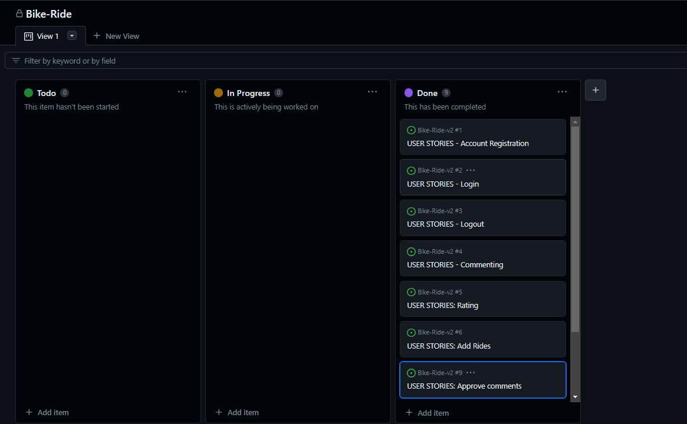

This project was developed using agile methodologies. All the features had to be done to make this web so user could use it. All the features were added from a agile.

### Features

#### Wireframes

main page
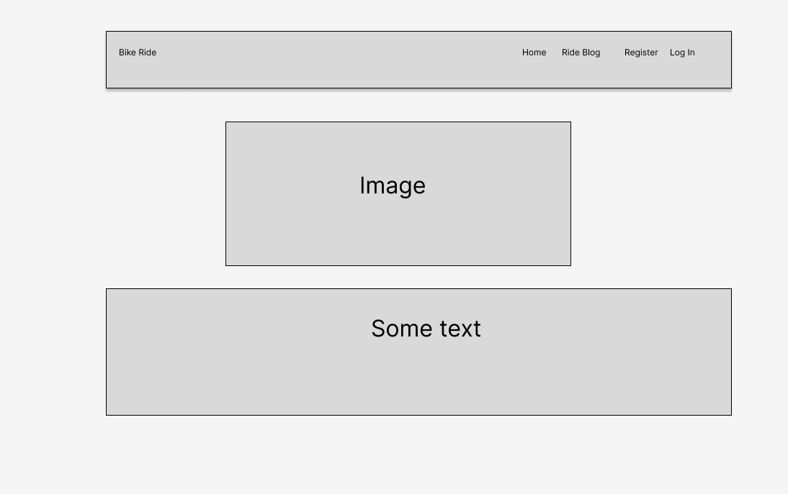

post page
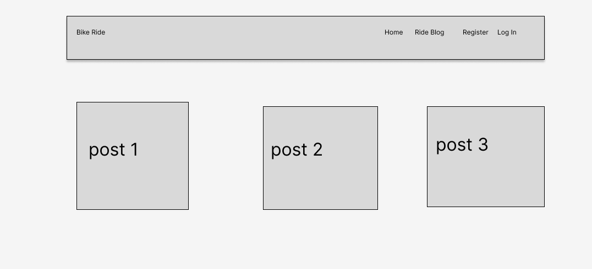

sign up page
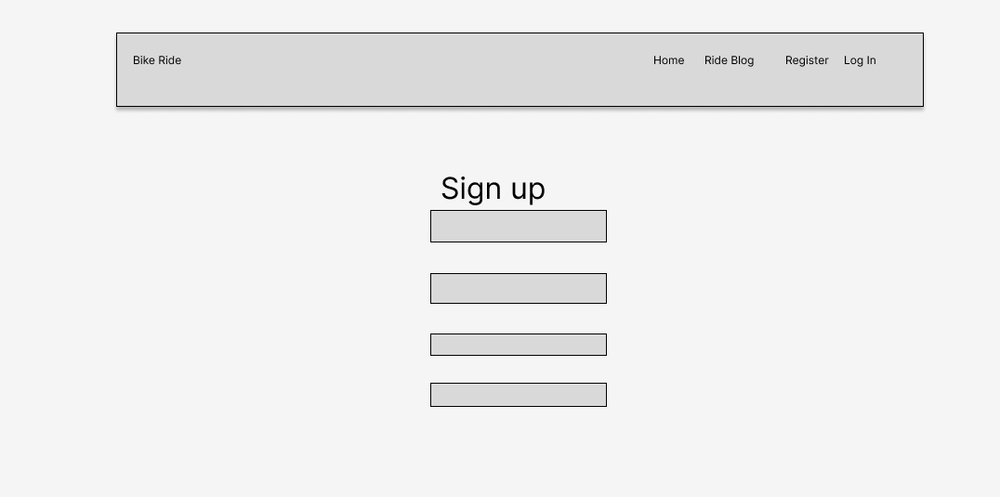

### Navigation 

Navbar user story - As a user I want to be able to navigate easily around the site easily from any devise
Navigation Menu When the user is not logged in the navigation menu links to the Home page, Ride Blog page, Register and the Login in page

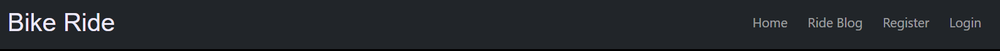

### Home page

User Story - As a user I want the front page to be clear and self-explanatory so I know I am in the right place
The front page contains a main image of the bike on the road. This will make it evident to the user that the website is about the bike rides.

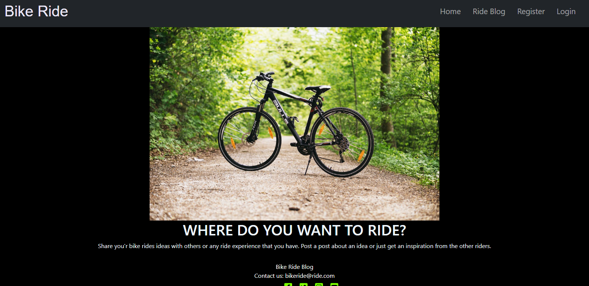

### Sign in, Sign up, Sign out

As a new user, you are able to sign up easily. As a returning user, you are able to log in easily. As a user, you are able to log out of the site safely and easily. As a developer, I want to ensure the forms are all the same style and look good on all devices.
Users can sign in and out using forms and confirmation pages. These forms were made using allauth.

This page allows registered users to sign in to use the site's features.
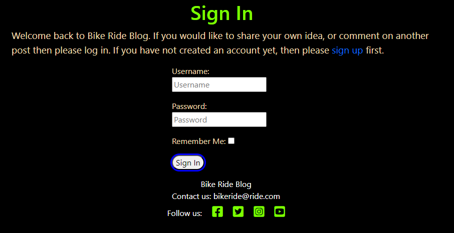

This page allows the user to sign up to use the website's features by creating a username and a password.
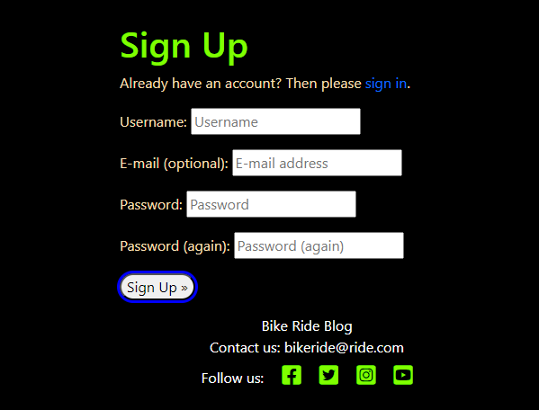

This page allows the user to sign out to keep their features safe from a third party.
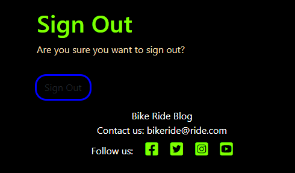

### Ride Blog Page

User Story: As a user that is not logged in, I want to be able to browse posts from other users.
Anybody can use the website to browse post, they are shown in the Ride Blog page with the titles and pictures, 3 posts per page. The post Title is a link to open up each post with further information about it. Also You can read the beginning of the post, difficulty of trial and distance.

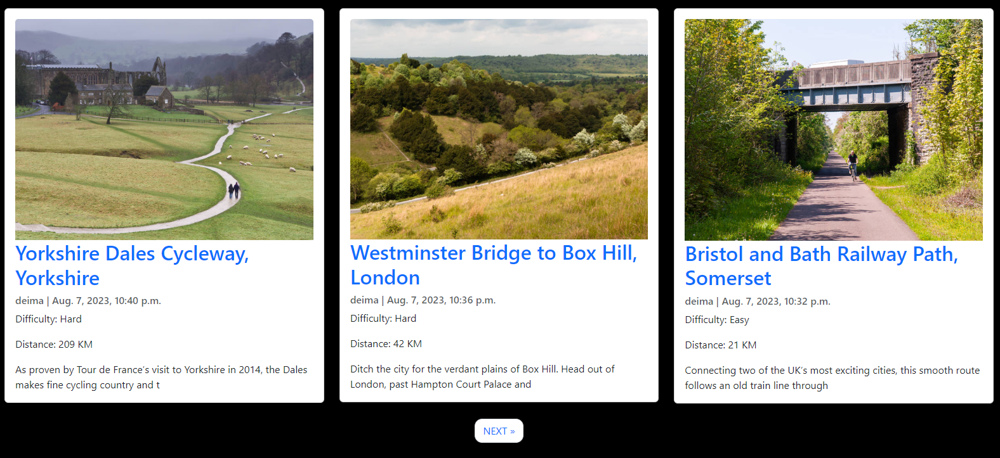

### Ride Detail Page

When the user clicks on the Ride post they will be directed to the full post information.  It looks a little different for authenticated and non-authenticated users. Non-authenticated users will see the ratings and the comments, but won't be granted the access to make their own. Authenticated users on the other hand are able to comment - their comment will be displayed on the page upon admin approval. They can rate as well. If the authenticated user happens to be the author of the post, they can edit and delete their post as well.

Post starts with the title, image and lower the image shows who posted and the time. If the user if post author they will be able to see option to delete or edit the post lower the title.

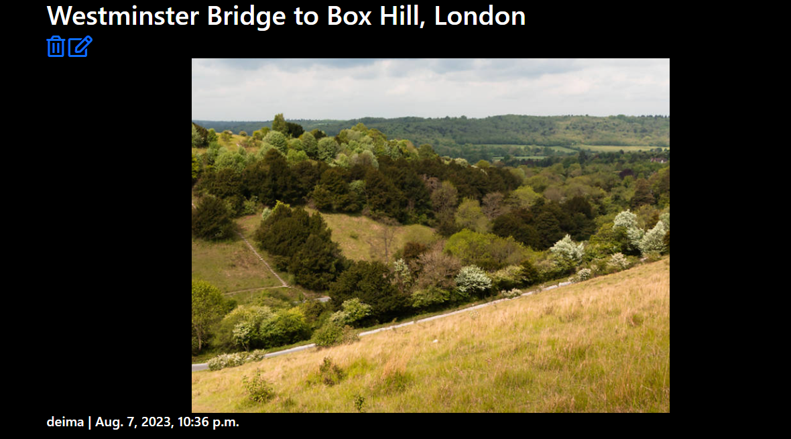

By going down user is able to see post context, where is the start ,end of track, distance, difficulty, average raiting, and comments.

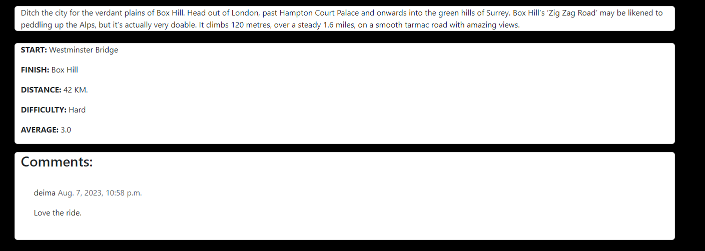

Lastly, authenticated user is able to rate the ride and leave the comment.

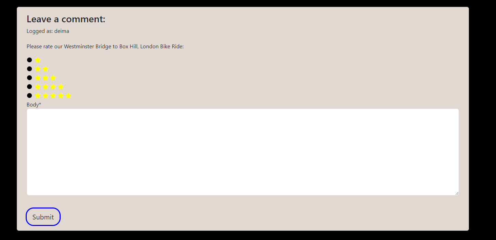

### Add Ride Post

User Story: As a user, I want to be able to input my own post.
Once the user is logged in they can create their own post using the create post form.
This page allows the authenticated user to add their own Ride.

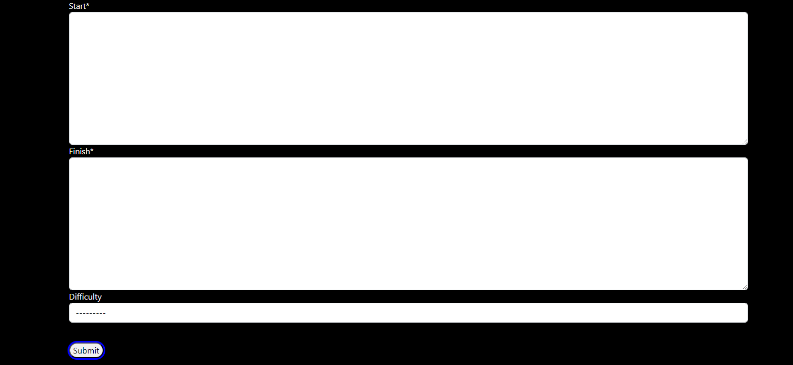

### Edit and Delete Post

As a post author, you are able to edit post that you have created. As a post author, you are able to delete post that you have created. As the site owner I want to ensure only the creator of an post can edit or delete it.
The creator of an post will be able to view edit and delete icons on their post detail page. The edit button will take them to the edit post form but it will be pre-populated with information that is already saved. The user can then update the information and save it again where they will be redirected back to the post page.

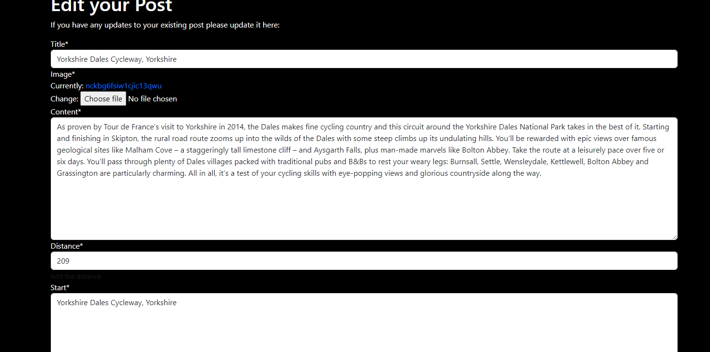

This page allows an authenticated user to delete their own ride.
The delete button will take the user to a confirmation page asking them to confirm they wish to delete that post. Once an post is deleted all comments will be deleted with it.

## Future Features

Edit comment: the access for the user to edit and delete their comment.

Email verifiation: make email signup mandatory and verifying the user.

Social sign in: use Google or othern forms of social sign in features.

## Database

The data was designed to give the user CRUD functionality once signed in. Posts are connected to the author by foreign key which allows author to edit and delete pots connected to their account.

## Technologies

HTML
    The structure of the site was made using HTML
CSS
    The website was styled using CSS in an external stylesheet
Python
    Python was the main programming language used within the django app
Github
    Source code was hosted in Github
javascript
    I used a very small amount of javascript to make the messages disappear

# Testing

## Code Validation

### HTML

The HTML files were validated with the W3C Validator Service.

Home page - PASS

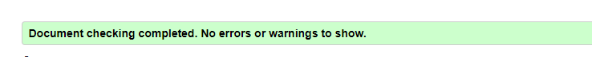

Blog page - PASS

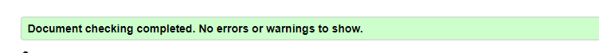

Post Detail - PASS

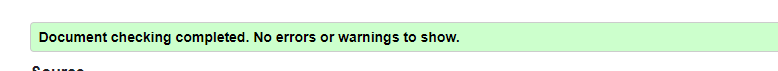

Sign Up - PASS

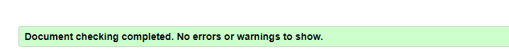

Log In - PASS

Testing was taken out to ensure a user could login to the website.
    Enter User Name and Password
    Click Sign Up

Outcome: User is redirected to the home page. The Navbar changed to show the create a post option and log out option.

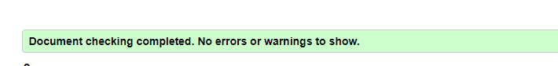

Create Post - PASS

Testing was taken out to ensure the user could create a new post.
When the user is logged in.
    Navigate to create a post page
    Complete form
    Click Submit

Outcome if all fields are filled in correctly the user will be redirected to the Ride Blog page. Page owner have to approve the post to be posted.

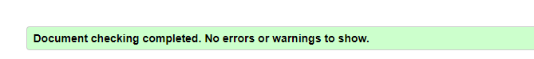

Delete Post - PASS

Tested to ensure a user could delete their post.

When the user is logged in
    Click on the post name
    If the user is the Author of the post, they will see a delete button and an Edit button under the Post Name
    Click the delete button
    User is taken to a Delete confirmation page asking them if their wish to delete that post showing the post name.
    Click Submit

Outcome: The user will be redirected back to the Ride Blog page and the post along with the comments will be deleted.

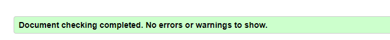

Edit Post - PASS

Tested to ensure the user could edit their post.
When the user is logged in
    If the user is the Author of the post, they will see a delete button and an Edit button under the post Name
    Click the edit button
    Update the fields you wish to update
    Click Submit

Outcome: The user will be redirected back to the Ride Blog page which will show the new information, and a message appears to say they have succesfully updated their post.

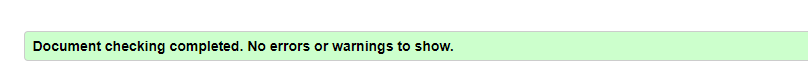

Log Out - PASS

Testing was taken out to ensure a user could log out of the website.
    Navigate to Log Out page
    Click Confirm button

Outcome: User is taken back to the homepage with the Create post option hidden and the Register option showing.

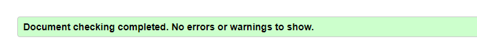

### CSS 

The CSS file was validated using the W3C Jigsaw Validator Service. It passed the validation process without warnings or errors.

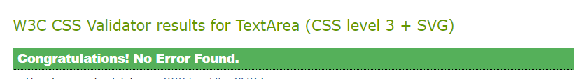

### Python pep8

The Python files were validated using the Pep8 linter

admin.py - PASS

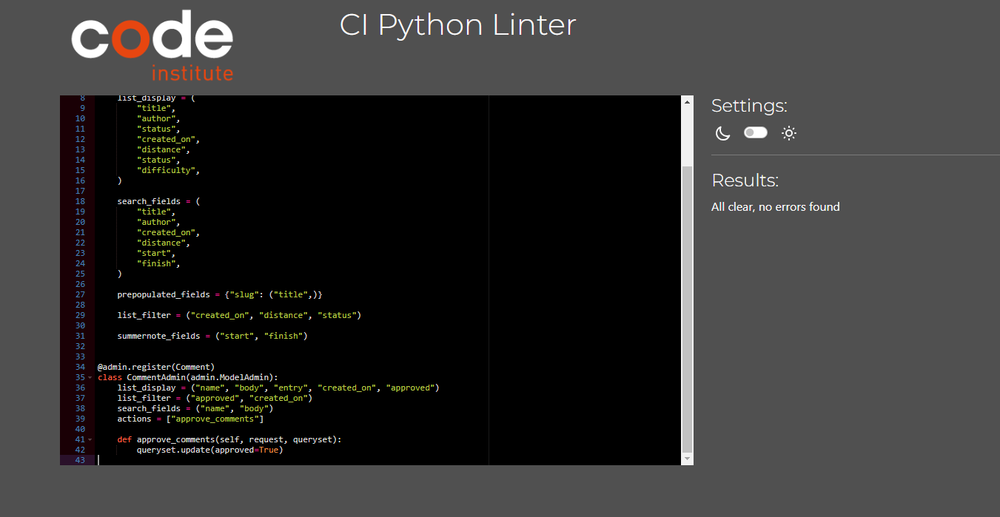

forms.py - PASS

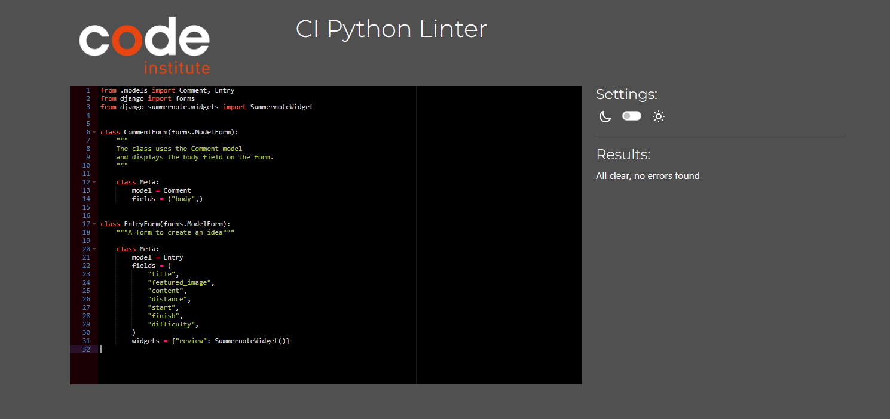

models.py - PASS

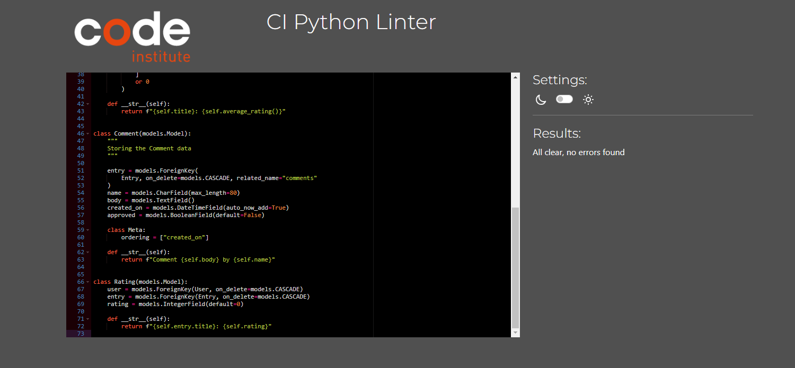

views.py - PASS

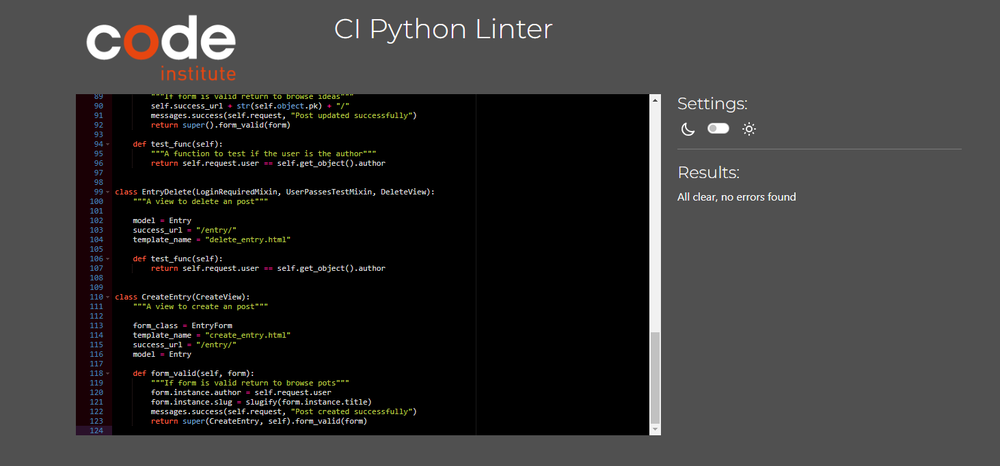

## Manual Testing

### Registration

A username is required
    If the cell is empty an error message is shown.

A password is required	
    An error message is shown if the password is invalid or missing.

Sign up button
    The signup button validates the form and the user is able to log in afterwards.

### Login/Logout

Login
    Previous registration is required for the user to be able to log in. The log in fields are obligatory. When a user is logged in, they should have access to the commenting, rating, and creating post.

Logout
    Logout option is only available for logged in users. Upon clicking the logout button, user should not have access to the previously available features and they should be able to navigate to the login form again. When clicking on the log out user will be asked if it confirmation if it want's to log out.

### Post management

Post creation
    - The user should be logged in to create a post. Once that feature is available in the naviagion bar, they should be directed to a form which can be saved after filling in the required fields. Admin authorization needed.

Post modification
    - The user should be logged in and be the author of the post to be able to modify it.

Post deletion
    - The user should be logged in and be the author of the post to be able to delete it.

### Commenting/Rating

See comments
    - Any user should be able to see the comments under a post.

Commenting
    - The user should be able to comment under a post if they are logged in. The admin has to approve the comment before it is visible on the page.

See ratings
    - Any user should be able to see the ratings on the post.

Rating
    - Logged in users should be able to choose from the different levels of rating.

## Deployment

To deploy my site to Heroku I followed the following steps

- Navigate to heroku and create/log into account
- Click the new button in the top right corner
- Select create new app
- Enter app name
- Select region and click create app (europe)
- Click the resources tab and search for Heroku Postgres
- Go to the settings tab and then click reveal config vars
- Add config vars
- Click the deploy tab
- Scroll down to Connect to GitHub and sign in / authorize when prompted
- In the search box, find the repository you want to deploy and click connect
- Scroll down to Manual deploy and choose the main branch
- Click Deploy

## References

- I also followed the Code Institute Blog walkthrough to start my project off.
- I used the django documentation
- I used the summernote documentation
- I used the bootstrap documentation

## Acknowledgements

- My mentor
- The wonderful slack community
- My girlfriend for putting up with my stress

## Bugs

- Deployment didn't work at first due to collectstatic error and crispy forms error