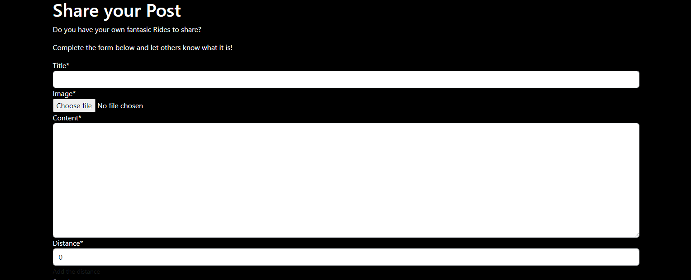

# Bike-Ride-v2

Bike-Ride is a ride blog share for everyone who is looking a new ride tracks or just want to share there ride. I wanted to create a page where people can share there experience with the bike rides, look for the new rides. It provides users a clear and simple way to browse and share rides.

### User Stories

This project was developed using agile methodologies. All the features had to be done to make this web so user could use it. All the features were added from a agile.

### Features

#### Wireframes

main page

post page

sign up page

### Navigation 

Navbar user story - As a user I want to be able to navigate easily around the site easily from any devise
Navigation Menu When the user is not logged in the navigation menu links to the Home page, Ride Blog page, Register and the Login in page

### Home page

User Story - As a user I want the front page to be clear and self-explanatory so I know I am in the right place
The front page contains a main image of the bike on the road. This will make it evident to the user that the website is about the bike rides.

### Sign in, Sign up, Sign out

As a new user, you are able to sign up easily. As a returning user, you are able to log in easily. As a user, you are able to log out of the site safely and easily. As a developer, I want to ensure the forms are all the same style and look good on all devices.
Users can sign in and out using forms and confirmation pages. These forms were made using allauth.

This page allows registered users to sign in to use the site's features.

This page allows the user to sign up to use the website's features by creating a username and a password.

This page allows the user to sign out to keep their features safe from a third party.

### Ride Blog Page

User Story: As a user that is not logged in, I want to be able to browse posts from other users.
Anybody can use the website to browse post, they are shown in the Ride Blog page with the titles and pictures, 3 posts per page. The post Title is a link to open up each post with further information about it. Also You can read the beginning of the post, difficulty of trial and distance.

### Ride Detail Page

When the user clicks on the Ride post they will be directed to the full post information.  It looks a little different for authenticated and non-authenticated users. Non-authenticated users will see the ratings and the comments, but won't be granted the access to make their own. Authenticated users on the other hand are able to comment - their comment will be displayed on the page upon admin approval. They can rate as well. If the authenticated user happens to be the author of the post, they can edit and delete their post as well.

Post starts with the title, image and lower the image shows who posted and the time. If the user if post author they will be able to see option to delete or edit the post lower the title.

By going down user is able to see post context, where is the start ,end of track, distance, difficulty, average raiting, and comments.

Lastly, authenticated user is able to rate the ride and leave the comment.

### Add Ride Post

User Story: As a user, I want to be able to input my own post.
Once the user is logged in they can create their own post using the create post form.
This page allows the authenticated user to add their own Ride.

### Edit and Delete Post

As a post author, you are able to edit post that you have created. As a post author, you are able to delete post that you have created. As the site owner I want to ensure only the creator of an post can edit or delete it.
The creator of an post will be able to view edit and delete icons on their post detail page. The edit button will take them to the edit post form but it will be pre-populated with information that is already saved. The user can then update the information and save it again where they will be redirected back to the post page.

This page allows an authenticated user to delete their own ride.
The delete button will take the user to a confirmation page asking them to confirm they wish to delete that post. Once an post is deleted all comments will be deleted with it.

